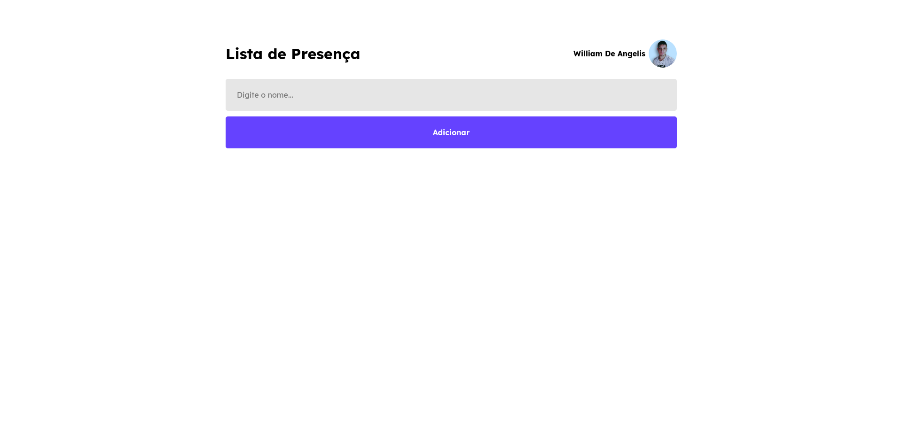

# Fundamentos do React Rockeseat

O projeto faz parte do módulo fundamentos de React da Rockeseat.

&nbsp;

Você também pode conferir o deploy na vercel pelo link: <https://app-list-rockeseat.vercel.app/>

&nbsp;

# Demonstração

## Adição de estudante a lista de presença


&nbsp;

## Funcionalidades

- Chamada a API do github com meu perfil
- Adição de estudantes
- Limpeza de input após adição de estudante

&nbsp;

## Stack utilizada

&nbsp;

**Front-end:** React, API do Github, Vite

&nbsp;

## Rodando localmente&nbsp;

&nbsp;

Clone o projeto

```bash
  git clone https://github.com/WillAngelis/App-List-Rockeseat.git
```

Entre no diretório do projeto

```bash
  cd App-List-Rockeseat/
```

Instale as dependências

```bash
  npm install
```

Inicie o servidor

```bash
  npm run dev
```

## Screenshots da Telas




## Aprendizados

Os fundamentos do React usados neste projeto foram:

- Componentes
- JSX
- Virtual DOM
- Props
- States
- Hooks useState e useEffect
- Criação do projeto com Vite
- Estrutura de pastas no React
- Ciclo de Renderização de um Componente
- Imutabilidade
- Chamada a API do Github usando o useEffect

&nbsp;

## Roadmap

[x] Limpeza de input após adição de estudante

[ ] Mudança de temas

[ ] Responsividade em vários dispositivos

[ ] Favicon Personalizado

[ ] Edição e Exclusão de estudante

[ ] Alterar usuário do Github

[ ] Salvar dados e tema escolhido em LocalStorage

[ ] Animações
